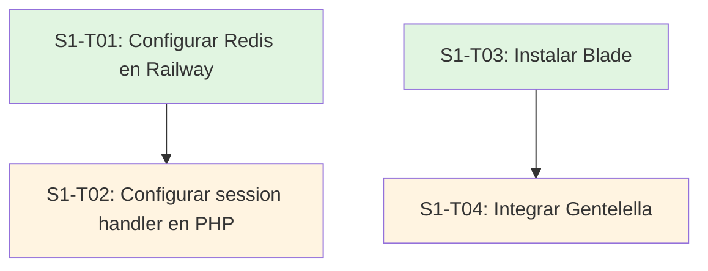
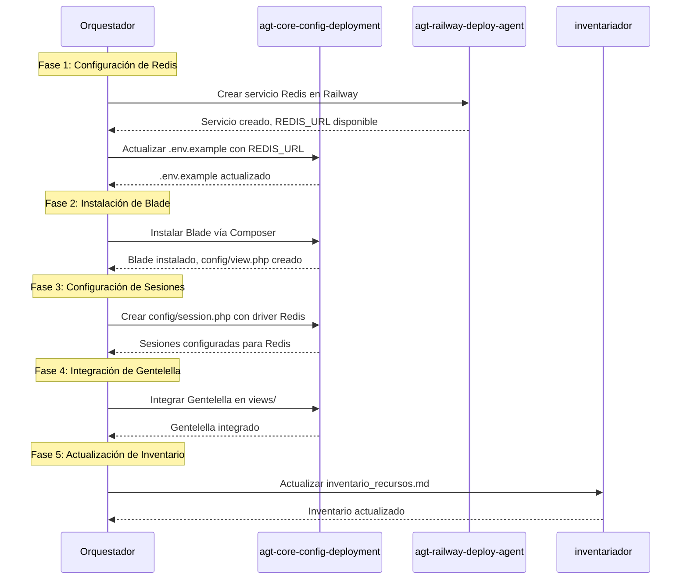
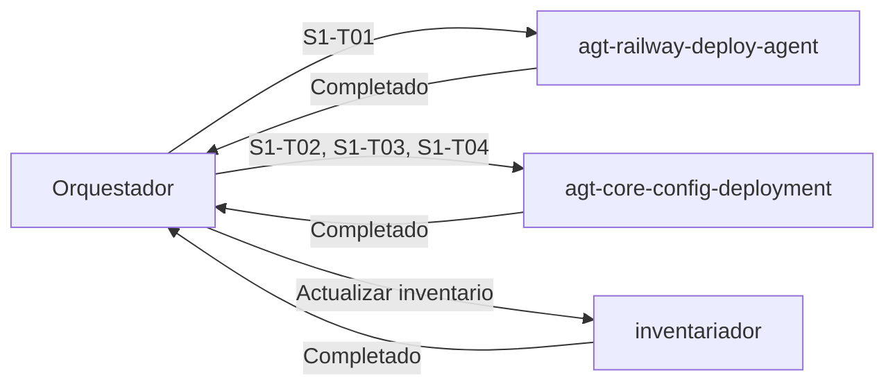

# Plan de Implementación - Sprint 1: Infraestructura Base

**Fecha**: 2026-03-25
**Sprint**: Sprint 1 - Infraestructura Base
**Duración**: Semana 1
**Objetivo**: Establecer infraestructura técnica para autenticación y UI
**Documento base**: `plan-sprints-fase-1.md`

---

## Índice de Contenido

1. [Resumen del Sprint](#1-resumen-del-sprint)
2. [Contexto y Referencias](#2-contexto-y-referencias)
3. [Desglose de Tareas](#3-desglose-de-tareas)
   - [S1-T01: Configurar Redis en Railway](#s1-t01-configurar-redis-en-railway)
   - [S1-T02: Configurar session handler en PHP](#s1-t02-configurar-session-handler-en-php)
   - [S1-T03: Instalar Blade](#s1-t03-instalar-blade)
   - [S1-T04: Integrar Gentelella](#s1-t04-integrar-gentelella)
4. [Dependencias entre Tareas](#4-dependencias-entre-tareas)
5. [Secuencia de Ejecución](#5-secuencia-de-ejecución)
6. [Validaciones y Definition of Done](#6-validaciones-y-definition-of-done)
7. [Agentes Responsables](#7-agentes-responsables)
8. [Riesgos y Mitigaciones](#8-riesgos-y-mitigaciones)
9. [Entregables del Sprint](#9-entregables-del-sprint)

---

## 1. Resumen del Sprint

### Objetivo Principal

Establecer la infraestructura técnica base necesaria para implementar autenticación y UI en el proyecto Hoja.

### Tareas Principales

| ID | Tarea | Prioridad | Complejidad |
|----|-------|-----------|-------------|
| S1-T01 | Configurar Redis en Railway | Alta | Media |
| S1-T02 | Configurar session handler en PHP | Alta | Media |
| S1-T03 | Instalar Blade | Alta | Baja |
| S1-T04 | Integrar Gentelella | Alta | Media |

### Valor Esperado

- Sesiones PHP almacenadas en Redis (escalabilidad en Railway)
- Blade configurado y funcional como motor de vistas
- Gentelella disponible en `views/` como UI base
- Infraestructura lista para Sprint 2 (Autenticación Backend)

---

## 2. Contexto y Referencias

### Reglas de Gobernanza Aplicables

| Regla | Aplicación | Descripción |
|-------|------------|-------------|
| **R2** | Crítica | Cero hardcoding - usar variables de entorno para configuración de Redis |
| **R3** | Crítica | Gestión de secrets - `REDIS_URL` como secret en Railway |
| **R8** | Crítica | Configuración de despliegue - Railway como plataforma confirmada |
| **R15** | Media | Solo el agente `inventariador` puede actualizar `inventario_recursos.md` |

### Referencias de Documentación

| Documento | Propósito |
|-----------|-----------|
| [`.governance/inventario_recursos.md`](../.governance/inventario_recursos.md) | Fuente de verdad para recursos, bindings y variables |
| [`doc_consolidada/configuracion-consolidada.md`](../doc_consolidada/configuracion-consolidada.md) | Configuración de variables de entorno y sesiones |
| [`doc_consolidada/ui-templates-consolidada.md`](../doc_consolidada/ui-templates-consolidada.md) | Gentelella como UI confirmada para MVP |
| [`doc_consolidada/autenticacion-consolidada.md`](../doc_consolidada/autenticacion-consolidada.md) | Sesiones + RBAC para MVP, Redis para almacenamiento |

### Estado Actual del Proyecto

| Componente | Estado | Referencia |
|------------|--------|------------|
| **Despliegue Railway** | ✅ Configurado | Proyecto ID: `e24d5972-55a9-4e19-99ed-87fc91461ecd` |
| **PostgreSQL** | ✅ Operativo | Servicio ID: `1caf13f3-23f7-4c79-a389-c7fef044bbef` |
| **Redis** | ❌ Pendiente | S1-T01 |
| **Blade** | ❌ Pendiente | S1-T03 |
| **Gentelella** | ❌ Pendiente | S1-T04 |
| **Session handler** | ⚠️ File (cambiar a Redis) | S1-T02 |

---

## 3. Desglose de Tareas

### S1-T01: Configurar Redis en Railway

#### Descripción

Crear y configurar el servicio Redis en Railway para almacenamiento de sesiones y caché.

#### Subtareas

| ID | Subtarea | Descripción |
|----|----------|-------------|
| S1-T01.1 | Crear servicio Redis | Crear servicio Redis en el proyecto Railway existente |
| S1-T01.2 | Configurar variable REDIS_URL | Añadir `REDIS_URL` como variable de entorno en Railway |
| S1-T01.3 | Actualizar .env.example | Documentar `REDIS_URL` en `.env.example` |
| S1-T01.4 | Verificar conexión | Validar que la aplicación puede conectar a Redis |

#### Archivos a Modificar

| Archivo | Acción | Descripción |
|---------|--------|-------------|
| `.env.example` | Modificar | Añadir `REDIS_URL` como variable de entorno |
| `config/session.php` | Crear/Modificar | Configurar driver Redis para sesiones |

#### Variables de Entorno

| Variable | Entorno | Sensible | Valor por defecto | Descripción |
|----------|---------|----------|-------------------|-------------|
| `REDIS_URL` | Todos | **Sí** | - | URL de conexión a Redis |

#### Reglas de Gobernanza

- **R2**: No hardcoding de `REDIS_URL` - usar variable de entorno
- **R3**: `REDIS_URL` como secret en Railway (no versionado)
- **R8**: Configuración de despliegue en Railway

---

### S1-T02: Configurar session handler en PHP

#### Descripción

Actualizar la configuración de sesiones de PHP para usar Redis como almacenamiento en lugar de archivos.

#### Subtareas

| ID | Subtarea | Descripción |
|----|----------|-------------|
| S1-T02.1 | Crear config/session.php | Crear archivo de configuración de sesiones |
| S1-T02.2 | Configurar driver Redis | Establecer `SESSION_DRIVER=redis` |
| S1-T02.3 | Configurar parámetros de sesión | Lifetime, cookie name, path, etc. |
| S1-T02.4 | Actualizar bootstrap | Cargar configuración de sesiones al inicio de la aplicación |
| S1-T02.5 | Probar almacenamiento | Verificar que las sesiones se guardan en Redis |

#### Archivos a Crear/Modificar

| Archivo | Acción | Descripción |
|---------|--------|-------------|
| `config/session.php` | Crear | Configuración de sesiones con driver Redis |
| `.env.example` | Modificar | Actualizar `SESSION_DRIVER=redis` |
| `src/App.php` o `public/index.php` | Modificar | Cargar configuración de sesiones |

#### Variables de Entorno

| Variable | Valor | Descripción |
|----------|-------|-------------|
| `SESSION_DRIVER` | `redis` | Driver de sesiones (cambiar de `file` a `redis`) |
| `SESSION_LIFETIME` | `120` | Duración de sesión en minutos |
| `SESSION_NAME` | `leaf_session` | Nombre de la cookie de sesión |

#### Reglas de Gobernanza

- **R2**: No hardcoding de parámetros de sesión
- **R4**: Crear accessor tipado para configuración de sesiones

---

### S1-T03: Instalar Blade

#### Descripción

Instalar el motor de vistas Blade vía Composer y configurar los paths necesarios.

#### Subtareas

| ID | Subtarea | Descripción |
|----|----------|-------------|
| S1-T03.1 | Instalar paquete Blade | Ejecutar `composer require leafs/blade` |
| S1-T03.2 | Configurar paths de vistas | Definir directorio `views/` para templates |
| S1-T03.3 | Configurar directorio de caché | Definir `storage/cache/views` para caché compilado |
| S1-T03.4 | Crear vista de prueba | Crear `views/test.blade.php` para validar instalación |
| S1-T03.5 | Probar renderizado | Verificar que Blade renderiza vistas correctamente |

#### Archivos a Crear/Modificar

| Archivo | Acción | Descripción |
|---------|--------|-------------|
| `composer.json` | Modificar | Añadir `leafs/blade` a dependencias |
| `config/view.php` | Crear | Configuración de Blade (paths, caché) |
| `views/test.blade.php` | Crear | Vista de prueba |
| `routes/web.php` | Modificar | Añadir ruta de prueba para Blade |

#### Dependencias

- Composer debe estar instalado
- Directorio `views/` debe existir

#### Reglas de Gobernanza

- **R2**: No hardcoding de paths - usar variables de entorno si es necesario
- **R11**: Ejecutar linters/typechecks después de instalar

---

### S1-T04: Integrar Gentelella

#### Descripción

Descargar y configurar la plantilla Gentelella en la estructura de vistas del proyecto.

#### Subtareas

| ID | Subtarea | Descripción |
|----|----------|-------------|
| S1-T04.1 | Descargar Gentelella | Obtener plantilla Gentelella (Bootstrap 5) |
| S1-T04.2 | Organizar estructura de directorios | Crear estructura en `views/` para Gentelella |
| S1-T04.3 | Extraer assets | Mover CSS, JS, imágenes a `public/` |
| S1-T04.4 | Crear layout base | Crear `views/layouts/app.blade.php` con estructura Gentelella |
| S1-T04.5 | Convertir vistas existentes | Migrar `index.view.php` y errores a Blade |
| S1-T04.6 | Probar integración | Verificar que la UI se muestra correctamente |

#### Archivos a Crear/Modificar

| Archivo | Acción | Descripción |
|---------|--------|-------------|
| `views/layouts/` | Crear | Directorio para layouts |
| `views/layouts/app.blade.php` | Crear | Layout base con Gentelella |
| `views/partials/` | Crear | Directorio para parciales (sidebar, navbar, footer) |
| `views/partials/sidebar.blade.php` | Crear | Componente sidebar |
| `views/partials/navbar.blade.php` | Crear | Componente navbar |
| `views/partials/footer.blade.php` | Crear | Componente footer |
| `views/index.blade.php` | Crear/Modificar | Vista principal usando layout |
| `views/errors/404.blade.php` | Crear/Modificar | Vista de error 404 |
| `views/errors/500.blade.php` | Crear/Modificar | Vista de error 500 |
| `public/assets/` | Crear | Directorio para assets estáticos |
| `public/assets/css/` | Crear | Directorio para CSS de Gentelella |
| `public/assets/js/` | Crear | Directorio para JS de Gentelella |
| `public/assets/img/` | Crear | Directorio para imágenes de Gentelella |

#### Dependencias

- S1-T03: Blade debe estar instalado y configurado

#### Reglas de Gobernanza

- **R5**: Código en inglés, documentación en español de España
- **R2**: No hardcoding de URLs de assets - usar helpers si es necesario

---

## 4. Dependencias entre Tareas

### Diagrama de Dependencias



### Matriz de Dependencias

| Tarea | Depende de | Razón |
|-------|------------|-------|
| **S1-T02** | S1-T01 | Redis debe estar configurado antes de usarlo como driver de sesiones |
| **S1-T04** | S1-T03 | Blade debe estar instalado antes de integrar Gentelella con Blade |

### Tareas Independientes

- S1-T01 y S1-T03 pueden ejecutarse en paralelo
- S1-T02 depende solo de S1-T01
- S1-T04 depende solo de S1-T03

---

## 5. Secuencia de Ejecución

### Flujo Principal



### Orden Sugerido de Ejecución

| Fase | Tarea | Agente | Paralelizable |
|------|-------|--------|---------------|
| 1 | S1-T01.1: Crear servicio Redis | `agt-railway-deploy-agent` | No |
| 1 | S1-T01.2: Configurar REDIS_URL | `agt-railway-deploy-agent` | No |
| 1 | S1-T01.3: Actualizar .env.example | `agt-core-config-deployment` | No |
| 1 | S1-T01.4: Verificar conexión | `agt-core-config-deployment` | No |
| 2 | S1-T03.1: Instalar Blade | `agt-core-config-deployment` | ✅ Sí (con Fase 1) |
| 2 | S1-T03.2: Configurar paths | `agt-core-config-deployment` | ✅ Sí (con Fase 1) |
| 2 | S1-T03.3: Configurar caché | `agt-core-config-deployment` | ✅ Sí (con Fase 1) |
| 2 | S1-T03.4: Crear vista de prueba | `agt-core-config-deployment` | ✅ Sí (con Fase 1) |
| 2 | S1-T03.5: Probar renderizado | `agt-core-config-deployment` | ✅ Sí (con Fase 1) |
| 3 | S1-T02.1: Crear config/session.php | `agt-core-config-deployment` | No |
| 3 | S1-T02.2: Configurar driver Redis | `agt-core-config-deployment` | No |
| 3 | S1-T02.3: Configurar parámetros | `agt-core-config-deployment` | No |
| 3 | S1-T02.4: Actualizar bootstrap | `agt-core-config-deployment` | No |
| 3 | S1-T02.5: Probar almacenamiento | `agt-core-config-deployment` | No |
| 4 | S1-T04.1: Descargar Gentelella | `agt-core-config-deployment` | No |
| 4 | S1-T04.2: Organizar estructura | `agt-core-config-deployment` | No |
| 4 | S1-T04.3: Extraer assets | `agt-core-config-deployment` | No |
| 4 | S1-T04.4: Crear layout base | `agt-core-config-deployment` | No |
| 4 | S1-T04.5: Convertir vistas | `agt-core-config-deployment` | No |
| 4 | S1-T04.6: Probar integración | `agt-core-config-deployment` | No |
| 5 | Actualizar inventario | `inventariador` | No |

---

## 6. Validaciones y Definition of Done

### Definition of Done Global del Sprint

- ✅ Todas las tareas completadas según su DoD individual
- ✅ Redis operativo en Railway y accesible desde la aplicación
- ✅ Sesiones PHP almacenadas en Redis (verificado en Redis CLI)
- ✅ Blade configurado y funcional (vistas renderizan correctamente)
- ✅ Gentelella disponible en `views/` y assets en `public/`
- ✅ Todas las variables de entorno documentadas en `.env.example`
- ✅ Inventario de recursos actualizado por `inventariador`
- ✅ Código sin errores de linting/typecheck
- ✅ Pruebas manuales ejecutadas y exitosas

### Definition of Done por Tarea

#### S1-T01: Configurar Redis en Railway

| Criterio | Validación |
|----------|------------|
| Servicio Redis creado | Verificar en dashboard de Railway |
| REDIS_URL configurada | Verificar variable de entorno en Railway |
| .env.example actualizado | Verificar archivo contiene `REDIS_URL` |
| Conexión funcional | Ejecutar script de prueba que conecta a Redis |
| **DoD** | ✅ Todos los criterios anteriores cumplidos |

#### S1-T02: Configurar session handler en PHP

| Criterio | Validación |
|----------|------------|
| config/session.php creado | Verificar archivo existe y está configurado |
| SESSION_DRIVER=redis | Verificar en .env.example |
| Sesiones se guardan en Redis | Crear sesión y verificar en Redis CLI |
| Parámetros de sesión configurados | Verificar lifetime, cookie name, etc. |
| **DoD** | ✅ Todos los criterios anteriores cumplidos |

#### S1-T03: Instalar Blade

| Criterio | Validación |
|----------|------------|
| leafs/blade instalado | Verificar en composer.json y vendor/ |
| config/view.php creado | Verificar archivo existe y está configurado |
| Paths de vistas configurados | Verificar directorio views/ y caché |
| Vista de prueba funciona | Acceder a ruta de prueba y ver HTML renderizado |
| **DoD** | ✅ Todos los criterios anteriores cumplidos |

#### S1-T04: Integrar Gentelella

| Criterio | Validación |
|----------|------------|
| Estructura de directorios creada | Verificar views/layouts/, views/partials/, public/assets/ |
| Layout base creado | Verificar views/layouts/app.blade.php |
| Parciales creados | Verificar sidebar, navbar, footer |
| Vistas convertidas a Blade | Verificar index.blade.php, errores |
| UI se muestra correctamente | Acceder a / y ver Gentelella renderizado |
| **DoD** | ✅ Todos los criterios anteriores cumplidos |

### Validaciones Automatizadas

| Validación | Herramienta | Frecuencia |
|------------|-------------|------------|
| Linting de PHP | PHP CS Fixer / Psalm | Después de cada tarea |
| Conexión a Redis | Script de prueba | S1-T01.4, S1-T02.5 |
| Renderizado de Blade | Test de ruta | S1-T03.5, S1-T04.6 |
| Verificación de assets | Check de archivos | S1-T04.6 |

---

## 7. Agentes Responsables

### Agentes Involucrados

| Agente | Responsabilidad | Tareas |
|--------|-----------------|--------|
| **agt-railway-deploy-agent** | Despliegue y configuración en Railway | S1-T01 |
| **agt-core-config-deployment** | Configuración, instalación, integración | S1-T02, S1-T03, S1-T04 |
| **inventariador** | Actualización del inventario de recursos | Final del sprint |

### Secuencia de Delegación



### Prompt de Delegación para S1-T01

```
Delegar a agt-railway-deploy-agent:

Tarea: Configurar Redis en Railway (S1-T01)

Subtareas:
1. Crear servicio Redis en el proyecto Railway existente (ID: e24d5972-55a9-4e19-99ed-87fc91461ecd)
2. Configurar variable de entorno REDIS_URL en Railway
3. Actualizar .env.example con REDIS_URL
4. Verificar conexión desde la aplicación

Reglas de gobernanza:
- R2: No hardcoding de REDIS_URL
- R3: REDIS_URL como secret en Railway
- R8: Configuración de despliegue en Railway

Referencias:
- .governance/inventario_recursos.md (Sección 0: Método de despliegue)
- doc_consolidada/configuracion-consolidada.md

Validaciones:
- Servicio Redis creado en Railway
- REDIS_URL configurada como variable de entorno
- .env.example actualizado
- Conexión verificada con script de prueba
```

### Prompt de Delegación para S1-T02, S1-T03, S1-T04

```
Delegar a agt-core-config-deployment:

Tarea: Configurar session handler, instalar Blade e integrar Gentelella (S1-T02, S1-T03, S1-T04)

S1-T02: Configurar session handler en PHP
1. Crear config/session.php con driver Redis
2. Configurar SESSION_DRIVER=redis en .env.example
3. Configurar parámetros de sesión (lifetime, cookie, etc.)
4. Actualizar bootstrap para cargar configuración
5. Probar que las sesiones se guardan en Redis

S1-T03: Instalar Blade
1. Instalar leafs/blade vía Composer
2. Crear config/view.php
3. Configurar paths de vistas y caché
4. Crear vista de prueba
5. Probar renderizado

S1-T04: Integrar Gentelella
1. Descargar Gentelella (Bootstrap 5)
2. Organizar estructura en views/ y public/assets/
3. Crear layout base y parciales
4. Convertir vistas existentes a Blade
5. Probar integración

Reglas de gobernanza:
- R2: No hardcoding de configuración
- R4: Crear accessor tipado para configuración
- R5: Código en inglés, documentación en español
- R11: Ejecutar linters/typechecks

Referencias:
- .governance/inventario_recursos.md
- doc_consolidada/configuracion-consolidada.md
- doc_consolidada/ui-templates-consolidada.md
- doc_consolidada/autenticacion-consolidada.md

Validaciones:
- Sesiones guardadas en Redis
- Blade renderiza vistas correctamente
- Gentelella se muestra en el navegador
- Código sin errores de linting
```

### Prompt de Delegación para Inventariador

```
Delegar a inventariador:

Tarea: Actualizar inventario_recursos.md después de Sprint 1

Cambios a registrar:
1. Servicio Redis creado en Railway
2. Variable REDIS_URL añadida
3. Blade instalado y configurado
4. Gentelella integrado en views/
5. Session handler configurado para Redis

Sección a actualizar:
- Sección 2: Recursos Confirmados (añadir Redis, Blade, Gentelella)
- Sección 3: Variables de Entorno (añadir REDIS_URL)
- Historial de cambios

Referencias:
- .governance/reglas_proyecto.md (R15: Solo inventariador puede actualizar)
- .governance/inventario_recursos.md
```

---

## 8. Riesgos y Mitigaciones

### Riesgos Identificados

| Riesgo | Probabilidad | Impacto | Mitigación |
|--------|-------------|---------|------------|
| Redis no disponible en Railway | Baja | Alta | Verificar disponibilidad de Redis en Railway antes de iniciar |
| Problemas de conexión a Redis | Media | Media | Crear script de prueba robusto con manejo de errores |
| Incompatibilidad de Blade con Leaf actual | Baja | Alta | Verificar compatibilidad en documentación de Leaf antes de instalar |
| Gentelella requiere dependencias adicionales | Media | Baja | Revisar documentación de Gentelella antes de integrar |
| Conflictos con vistas existentes | Baja | Media | Hacer backup de vistas existentes antes de convertir |
| Límites de Railway (costos) | Baja | Media | Monitorear uso de recursos en Railway |

### Plan de Contingencia

| Escenario | Acción |
|-----------|--------|
| Redis no disponible en Railway | Usar almacenamiento de sesiones en BD PostgreSQL como alternativa |
| Blade incompatible con Leaf actual | Investigar versión compatible o usar BareUI como alternativa |
| Gentelella no se integra bien | Considerar template Bootstrap 5 simple sin Gentelella |

---

## 9. Entregables del Sprint

### Entregables Principales

| Entregable | Descripción | Verificación |
|------------|-------------|--------------|
| **Redis en Railway** | Servicio Redis operativo y conectado | Servicio visible en dashboard Railway |
| **Session handler Redis** | Sesiones PHP almacenadas en Redis | Sesiones visibles en Redis CLI |
| **Blade instalado** | Motor de vistas Blade configurado | Vistas Blade renderizan correctamente |
| **Gentelella integrado** | UI base disponible en `views/` | Gentelella visible en navegador |
| **.env.example actualizado** | Variables de entorno documentadas | Archivo contiene REDIS_URL, SESSION_DRIVER=redis |
| **Inventario actualizado** | Recursos nuevos registrados | inventario_recursos.md actualizado |

### Archivos Nuevos/Modificados

| Archivo | Estado | Descripción |
|---------|--------|-------------|
| `.env.example` | Modificado | Añadido REDIS_URL, SESSION_DRIVER=redis |
| `config/session.php` | Nuevo | Configuración de sesiones con driver Redis |
| `config/view.php` | Nuevo | Configuración de Blade |
| `views/layouts/app.blade.php` | Nuevo | Layout base con Gentelella |
| `views/partials/sidebar.blade.php` | Nuevo | Componente sidebar |
| `views/partials/navbar.blade.php` | Nuevo | Componente navbar |
| `views/partials/footer.blade.php` | Nuevo | Componente footer |
| `views/index.blade.php` | Modificado | Vista principal usando Blade |
| `views/errors/404.blade.php` | Modificado | Vista de error 404 en Blade |
| `views/errors/500.blade.php` | Modificado | Vista de error 500 en Blade |
| `public/assets/` | Nuevo | Directorio de assets estáticos |
| `.governance/inventario_recursos.md` | Modificado | Inventario actualizado |

### Pruebas de Aceptación

| Prueba | Descripción | Resultado Esperado |
|--------|-------------|-------------------|
| Conexión Redis | Script de prueba conecta a Redis | Conexión exitosa |
| Sesión en Redis | Crear sesión y verificar en Redis CLI | Sesión visible en Redis |
| Blade renderiza | Acceder a ruta de prueba | HTML renderizado correctamente |
| Gentelella visible | Acceder a / | UI de Gentelella mostrada |
| Variables de entorno | Verificar .env.example | REDIS_URL y SESSION_DRIVER presentes |

---

## 10. Preparación para Sprint 2

### Dependencias hacia Sprint 2

| Componente de Sprint 1 | Uso en Sprint 2 |
|------------------------|-----------------|
| Redis en Railway | Almacenamiento de sesiones para autenticación |
| Session handler Redis | Gestión de sesiones de usuarios |
| Blade | Renderizado de vistas de login y dashboard |
| Gentelella | UI para formulario de login y dashboard |

### Checklist de Transición

- [ ] Redis operativo y accesible
- [ ] Sesiones funcionando en Redis
- [ ] Blade configurado y probado
- [ ] Gentelella integrado y visible
- [ ] Inventario actualizado
- [ ] Documentación actualizada
- [ ] Sin errores de linting/typecheck
- [ ] Pruebas manuales exitosas

---

## Referencias

### Documentos de Gobernanza

- [`.governance/reglas_proyecto.md`](../.governance/reglas_proyecto.md) - Reglas obligatorias del proyecto
- [`.governance/inventario_recursos.md`](../.governance/inventario_recursos.md) - Fuente de verdad para recursos
- [`.governance/agentes_disponibles.md`](../.governance/agentes_disponibles.md) - Registro de agentes

### Documentos Consolidados

- [`doc_consolidada/configuracion-consolidada.md`](../doc_consolidada/configuracion-consolidada.md) - Configuración de variables y sesiones
- [`doc_consolidada/ui-templates-consolidada.md`](../doc_consolidada/ui-templates-consolidada.md) - Gentelella y Blade
- [`doc_consolidada/autenticacion-consolidada.md`](../doc_consolidada/autenticacion-consolidada.md) - Sesiones y Redis

### Documentos de Planificación

- [`doc_revisiones/plan-sprints-fase-1.md`](plan-sprints-fase-1.md) - Plan general de FASE 1

### Documentos de Decisión

- [`doc_decisiones/despliegue.md`](../doc_decisiones/despliegue.md) - Decisiones de despliegue en Railway
- [`doc_decisiones/autenticacion.md`](../doc_decisiones/autenticacion.md) - Decisiones de autenticación
- [`doc_decisiones/ui.md`](../doc_decisiones/ui.md) - Decisiones de UI

---

**Fin del documento**
